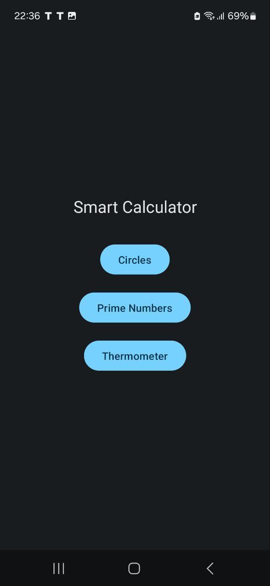
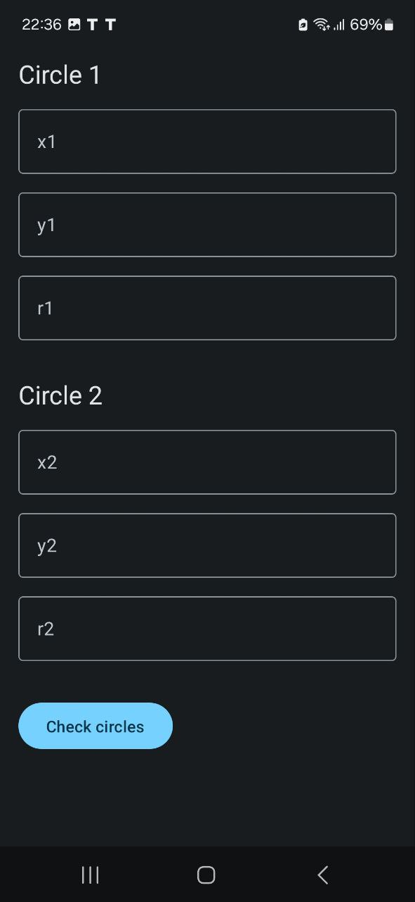
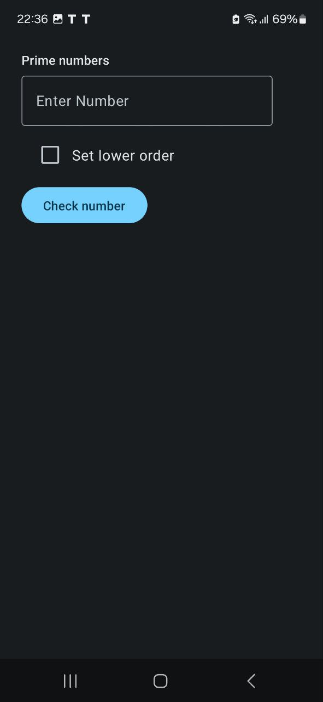
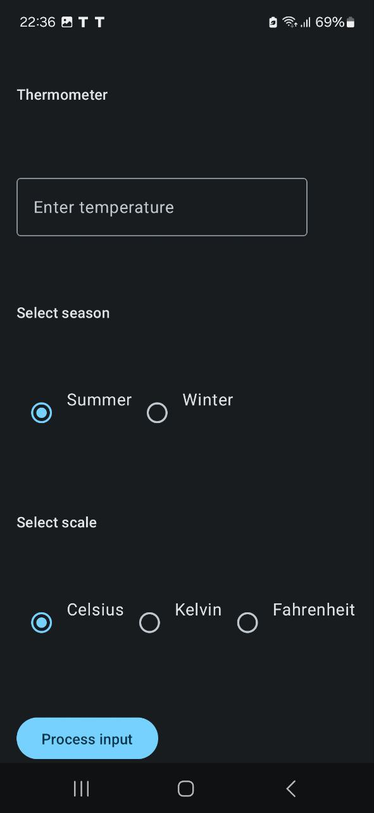

Smart Calculator
Smart Calculator — это приложение, которое помогает выполнять три уникальные задачи:

## Главный экран

Проверяет, пересекаются ли две окружности.
Находит простое число в последовательности цифр.
Даёт рекомендации по настройке кондиционера в зависимости от текущей температуры.
Функциональность
1. Проверка пересечения окружностей
Позволяет пользователям вводить параметры двух окружностей (координаты центра и радиус) и проверять, пересекаются ли они.

3. Нахождение простого числа
Находит ближайшее простое число в заданной последовательности цифр.

5. Рекомендации по настройке кондиционера
Исходя из текущей температуры, даёт пользователям рекомендации по оптимальной настройке кондиционера для комфортного климата.

 

Установка и запуск
Для запуска проекта следуйте этим шагам:

Склонируйте репозиторий:

git clone https://github.com/dimax77/SmartCalculator.git

Перейдите в директорию проекта:

cd smart-calculator
Соберите и запустите проект:

Для Android:
Откройте проект в Android Studio
Нажмите кнопку Run

Технологии
Котлин для разработки на Android.
Retrofit для работы с сетевыми запросами.
Dagger для внедрения зависимостей.
Android Jetpack Components для управления состоянием и навигацией.
Требования
Android SDK 21+
Поддержка API версии 5.0 (Lollipop) и выше.
Лицензия
Этот проект лицензирован под лицензией MIT
